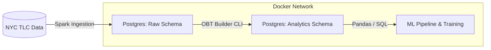

# 🚕 NYC Taxi Fare Prediction Pipeline

> **End-to-End Big Data Pipeline utilizing Apache Spark and PostgreSQL to process 10+ years of NYC TLC Trip Records and predict total fares using Regularized Linear Models.**

[](https://www.python.org/)
[](https://spark.apache.org/)
[](https://www.postgresql.org/)
[](https://www.docker.com/)
[](https://scikit-learn.org/)

[Overview](#-overview) • [Architecture](#-system-architecture) • [Data Engineering](#-data-engineering--etl) • [Machine Learning](#-machine-learning-strategy) • [Results](#-benchmarks--results) • [How to Run](#-how-to-run)

---

## 📋 Overview

This project implements a **scalable Data Mining and Machine Learning pipeline** designed to predict the `total_amount` of a taxi trip in New York City **before the trip begins**.

Unlike simple analysis scripts, this is a robust engineering solution capable of ingesting, cleaning, and processing the massive **NYC TLC Trip Record dataset (2015–2025)**, comprising hundreds of millions of rows.

### Key Technical Achievements
- **Scalable Ingestion** using Apache Spark for large Parquet datasets  
- **Idempotent ETL** design, safe to re-run without duplication  
- **Strict Temporal Splitting** to prevent data leakage  
- **From-Scratch ML Implementations** (SGD, Ridge, Lasso) benchmarked against Scikit-Learn  

---

## 🏗 System Architecture

The entire stack is containerized using **Docker Compose**, ensuring full reproducibility.



### Services

| Service | Description |
|------|------------|
| spark-notebook | Jupyter environment with PySpark for ETL prototyping |
| postgres | Relational storage with raw & analytics schemas |
| obt-builder | Python CLI orchestrating Raw → OBT transformations |

---

## ⚙️ Data Engineering & ETL

### 1. Ingestion Layer (Apache Spark)

- **Source**: Yellow & Green Taxi trip records (Parquet)
- **Target**: PostgreSQL `raw` schema
- **Idempotency**: Partition-level *Delete → Write* logic  
  (Service / Year / Month)

---

### 2. One Big Table (OBT) Strategy

Raw normalized tables are transformed into a denormalized analytical table:  
`analytics.obt_trips`, optimized for ML workloads.

#### Automated Cleaning Rules
- `pickup_time < dropoff_time`
- `trip_distance > 0`
- `total_amount > 0`

#### Enrichment
- Geospatial joins using `taxi_zone_lookup`
- Borough and Zone resolution

#### Build Command
```bash
docker compose run obt-builder \
  --mode full \
  --year-start 2015 --year-end 2025 \
  --services yellow,green \
  --run-id production_v1 \
  --overwrite true
```

---

## 🧠 Machine Learning Strategy

### Problem Definition
- **Regression task**: Predict `total_amount`
- **Constraint**: Only variables known at pickup time
- **Leakage Prevention**:
  - Excludes dropoff time
  - Excludes trip duration
  - Excludes post-trip surcharges

---

### Feature Engineering

- **Temporal**
  - `pickup_hour`, `day_of_week`
  - `is_peak_hour`, `is_weekend`

- **Spatial**
  - `pickup_borough`
  - `pickup_zone` (Top 100 + "Other")

- **Encoders**
  - One-Hot Encoding for categorical features

- **Polynomial Features**
  - Interaction terms for distance × hour

---

### Models Implemented

Two parallel pipelines were developed to demonstrate depth of understanding:

#### From Scratch (NumPy)
- Stochastic Gradient Descent
- Ridge Regression (L2)
- Lasso Regression (L1)

#### Production (Scikit-Learn)
- SGDRegressor
- Ridge
- Lasso
- ElasticNet

---

## 📊 Benchmarks & Results

Models were evaluated using **strict temporal splits**:

- Train: 2015–2022  
- Validation: 2023  
- Test: 2024  

### Test Set Performance

| Model | RMSE ($) | R² | Verdict |
|----|----|----|----|
| Ridge Regression (L2) | **3.89** | **0.54** | 🏆 Winner |
| ElasticNet | 4.12 | 0.51 | Strong Alternative |
| Lasso Regression (L1) | 8.97 | 0.48 | Underfit |

**Conclusion**  
Ridge Regression offers the best bias–variance trade-off, explaining ~54% of fare variance—significant given NYC traffic complexity and tipping behavior.

---

## 🚀 How to Run

### Prerequisites
- Docker & Docker Compose
- ~10GB free disk space

---

### 1. Start Infrastructure
```bash
docker compose up -d postgres
docker compose up -d spark-notebook
```

---

### 2. Ingest Data
- Open: http://localhost:8888
- Run: `01_ingest_raw.ipynb`
- Config: Set `SELECTIVE_MODE = False` for full ingestion

---

### 3. Build Analytics Table
```bash
docker compose run obt-builder \
  --mode full \
  --year-start 2015 --year-end 2015 \
  --services yellow \
  --overwrite true
```

---

### 4. Train Models
Run:
- `ml_total_amount_regression.ipynb`

Includes training, evaluation, and visualization.

---

## 📂 Project Structure

```text
├── data/                  # Local mount for raw data
├── docker/                # Dockerfiles
├── notebooks/
│   ├── 01_ingest_raw.ipynb
│   └── ml_total_amount_regression.ipynb
├── src/
│   ├── obt_builder.py     # ETL Logic
│   └── models/            # Custom ML implementations
├── docker-compose.yml
└── README.md
```

---

<div align="center">
Project developed by <strong>Joel Cuascota</strong><br/>
</div>
